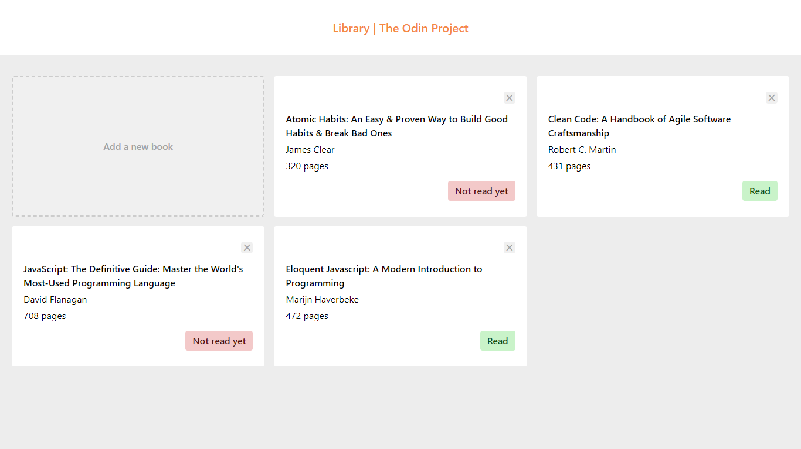
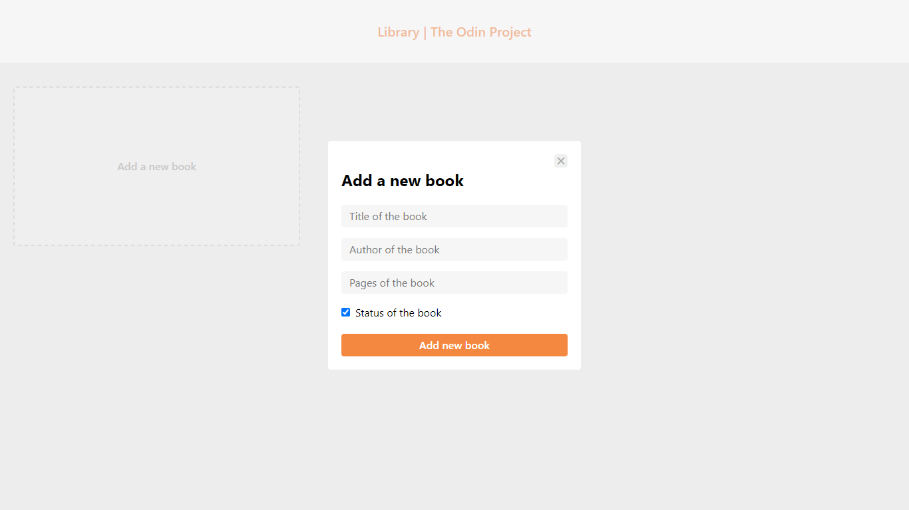
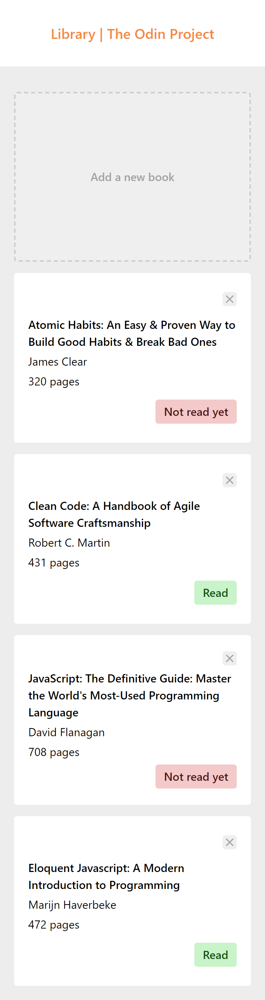

### Library

This is a solution to The Odin Project's [Library Project](https://www.theodinproject.com/lessons/node-path-javascript-library). It aims to practice the fundamental concepts about prototypes by creating a simple library app.

[View demo](#view-demo)
•
[Screenshots](#screenshots)
•
[Built with](#built-with)

#### View demo

[Click here to see the live demo of this project on GitHub Pages.](https://jsklcodes.github.io/library)

#### Screenshots

Library on desktop

Modal to add books on desktop

&nbsp;

Library on mobile

#### Built with

- CSS custom properties
- CSS Grid
- Responsive design
- Prototypes
